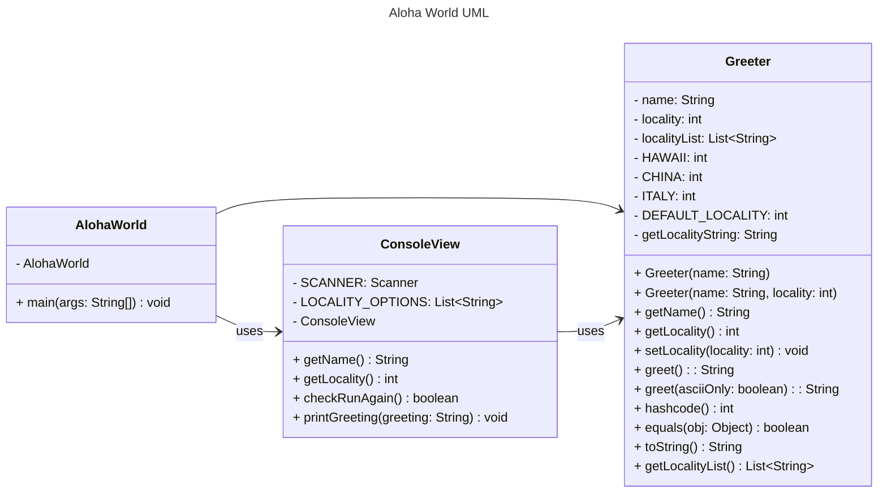

# Markdown Playground

Use this file to add example markdown elements you learned about by reading the markdown resources below. You need to add at least 3 different markdown elements you learned about, and a mermaid class diagram (of your choice does not have to follow the assignment. However, if you did use mermaid for the assignment, you can just copy that here).
    
1. Bold: To bold text, add two asterisks or underscores before and after a word or phrase.
    * E.g. **I love you.**
2. Underline: To create an underline, add `&lt;ins&gt; </ins>` before and after the word or phrase.
    * E.g. I love <ins>you</ins>.
3. Strikethrough:  To strikethrough a text, add ~~ before and after a word or phrase.
    * E.g. ~~This is a mistake~~

Mermaid is a markdown language that allows you to create diagrams. You can find more information about mermaid in the resources below. It has become popular enough that github has included it as an option in their markdown.  For built in markdown readers, such as the one built into IntelliJ or VSCode, you may need to install a plugin to render the mermaid diagrams. 

> [!NOTE]
> [IntelliJ Mermaid Plugin](https://plugins.jetbrains.com/plugin/20146-mermaid). Also for intelliJ, this is often installed by default, but incase it isn't [Markdown Plugin IntelliJ](https://plugins.jetbrains.com/plugin/7793-markdown). 

> [!NOTE] 
> [VS Code Mermaid Preview](https://marketplace.visualstudio.com/items?itemName=bierner.markdown-mermaid). Markdown preview is enabled by default, but if you want the full github flavored markdown, [Github Styling Preview](https://marketplace.visualstudio.com/items?itemName=bierner.markdown-preview-github-styles) is popular. 

## Markdown Resources

* [Markdown Guide](https://www.markdownguide.org/basic-syntax/)
* [Github Flavored Markdown](https://guides.github.com/features/mastering-markdown/)
* [Github Markdown Getting Started](https://docs.github.com/en/get-started/writing-on-github/getting-started-with-writing-and-formatting-on-github/basic-writing-and-formatting-syntax)
* [Mermaid Syntax Reference](https://mermaid.js.org/intro/syntax-reference.html) 

<!-- start your playground code under this dashed line -->
----
