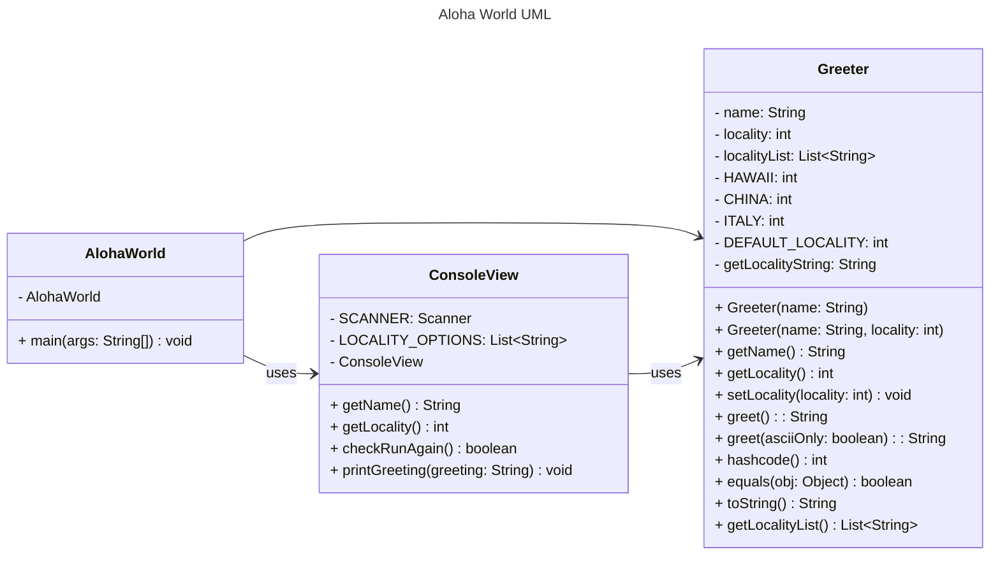

# Homework Aloha World Report

The following report contains questions you need to answer as part of your submission for the homework assignment. 

## Design Doc
Please link your UML design file here. See resources in the assignment on how to
link an image in markdown. You may also use [mermaid] class diagrams if you prefer, if so, include the mermaid code here.  You DO NOT have to include Greeting.java as part of the diagram, just the AlohaWorld application that includes: [AlohaWorld.java], [Greeter.java], and [ConsoleView.java].

### Program Flow
Write a short paragraph detailing the flow of the program in your own words. This is to help you understand / trace the code (and give you practice of something called a code walk that will be required in this course).

   The program starts in main() in AlohaWorld which then asks the client for their name and location with ConsoleView.getName() and ConsoleView.getLocality(). The Greeter object is created using the name and location that are provided. The Greeter.greet() method generates a greeting based on location. The ConsoleView.printGreeting() method prints the greeting to the client. The ConsoleView.checkRunAgain() method asks the client if they want to be greeted again. If client selects "yes", the program will get the location input from user again using ConsoleView.getLocality(). If the client selects "no", the program will end.

## Assignment Questions

1. List three additional java syntax items you didn't know when reading the code.  (make sure to use * for the list items, see example below, the backtick marks are used to write code inline with markdown)
   
   * (example) `final class`
   * `static final`
   * `switch`
   * `instanceof`

2. For each syntax additional item listed above, explain what it does in your own words and then link a resource where you figured out what it does in the references section. 

    * (example) The `final` keyword when used on a class prevents the class from being subclassed. This means that the class cannot be extended by another class. This is useful when you want to prevent a class from being modified or extended[^1] . It is often the standard to do this when a class only contains static methods such as driver or utility classes. Math in Java is an example of a final class[^2] .
    * The `static final` creates a variable that cannot be changed later in the code. It is helpful which allows reusing the variable and enhances the readability of the code. It also helps deliver better performance because its values are embedded during compilation rather than being retrieved during runtime [^3].
    * The `switch` is a statement by evaluating the expression and comparing expression with each case inside the switch to find a match. If there is a match, the code inside the case block will be executed [^4]. 
    * `instanceof` is a useful keyword to check whether an object belongs to a specific class and will return True or False [^5].

3. What does `main` do in Java? 

    Main method is the start point when the program begins running. If main method is empty, Java virtual machine will not execute any codes.

4. What does `toString()` do in Java? Why should any object class you create have a `toString()` method?

    The toString() method in Java returns a string representation of an object. By default, all the object classes have toString() method showing the class name and memory address. By creating a toString() method, it will override the previous information and become more useful information about this object class. [^6]

5. What is javadoc style commenting? What is it used for? 

   Javadoc style commenting is a way to write structured comments in Java using /** */. It is primarily used to generate documentation for such as classes and methods. The comments include detailed descriptions for each section, parameter and its description, and the description of return values if there is any.

6. Describe Test Driving Development (TDD) in your own words. 

    Test Driving Development is an approach for software development by writing test before diving into code. There are three steps for TDD. The first is to write the test that will fail. The second is to write the code and make the test pass. The third is to refine the code while fulfilling the test case [^7].  

7. Go to the [Markdown Playground](MarkdownPlayground.md) and add at least 3 different markdown elements you learned about by reading the markdown resources listed in the document. Additionally you need to add a mermaid class diagram (of your choice does not have to follow the assignment. However, if you did use mermaid for the assignment, you can just copy that there). Add the elements into the markdown file, so that the formatting changes are reserved to that file. 

## Deeper Thinking Questions

These questions require deeper thinking of the topic. We don't expect 100% correct answers, but we encourage you to think deeply and come up with a reasonable answer. 

1. Why would we want to keep interaction with the client contained to ConsoleView?

   This helps create a program with classes each has its distinct responsibility and functionality. When testing function whether the program is getting the client name or location correctly, we only need to test it in ConsoleViewtest, which makes it more straightforward and clearer.

2. Right now, the application isn't very dynamic in that it can be difficult to add new languages and greetings without modifying the code every time. Just thinking programmatically,  how could you make the application more dynamic? You are free to reference Geeting.java and how that could be used in your design.

   Inside the greeting class, The greeter class can hold a greeting object instead of typing every language and location inside greet method.

> [!IMPORTANT]
>  After you upload the files to your github (ideally you have been committing throughout this progress / after you answer every question) - make sure to look at your completed assignment on github/in the browser! You can make sure images are showing up/formatting is correct, etc. The TAs will actually look at your assignment on github, so it is important that it is formatted correctly.

## References

[^1]: Final keyword in Java: 2024. https://www.geeksforgeeks.org/final-keyword-in-java/. Accessed: 2024-03-30. 

[^2]: Math (Java Platform SE 17). https://docs.oracle.com/en/java/javase/17/docs/api/java.base/java/lang/Math.html. Accessed: 2024-03-30.

[^3]: Static Final Variables in Java https://www.baeldung.com/java-static-final-variables Accessed: 2025-01-26

[^4]: Java Switch https://www.w3schools.com/java/java_switch.asp Accessed: 2025-01-26

[^5]: Java instanceof Keyword https://www.w3schools.com/java/ref_keyword_instanceof.asp Accessed: 2025-01-26

[^6]: Object toString() Method in Java https://www.geeksforgeeks.org/object-tostring-method-in-java/ Accessed: 2025-01-26

[^7]: What is Test Driven Development (TDD)? https://www.geeksforgeeks.org/test-driven-development-tdd/ Accessed: 2025-01-26
<!-- This is a comment, below this link the links in the document are placed here to make ti easier to read. This is an optional style for markdown, and often as a student you will include the links inline. for example [mermaid](https://mermaid.js.org/intro/syntax-reference.html) -->
[mermaid]: https://mermaid.js.org/intro/syntax-reference.html
[AlohaWorld.java]: src/main/java/student/AlohaWorld.java
[Greeter.java]: src/main/java/student/Greeter.java
[ConsoleView.java]: src/main/java/student/ConsoleView.java